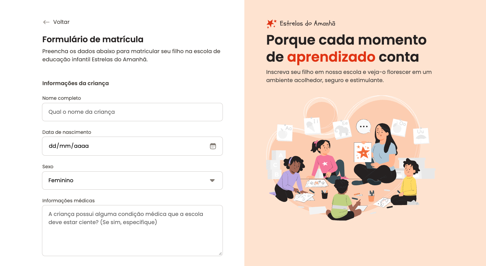

# 📝 Formulário de Matrícula - Estrelas do Amanhã



## 📋 Descrição

Este é um formulário de matrícula interativo e responsivo desenvolvido para a escola de educação infantil **Estrelas do Amanhã**. O projeto oferece uma experiência de usuário moderna e intuitiva para pais que desejam matricular seus filhos na instituição.

## ✨ Características

- **Design Responsivo**: Adaptável a diferentes tamanhos de tela
- **Interface Moderna**: Design limpo e profissional
- **Validação de Formulário**: Campos com validação em tempo real
- **Upload de Arquivos**: Área para upload de documentos
- **Seleção de Esportes**: Múltiplas opções de atividades esportivas
- **Acessibilidade**: Desenvolvido seguindo boas práticas de acessibilidade

## 🛠️ Tecnologias Utilizadas

- **HTML5**: Estrutura semântica e acessível
- **CSS3**: Estilização moderna com Flexbox e Grid
- **JavaScript**: Interatividade e validação de formulários
- **Google Fonts**: Tipografia Poppins para melhor legibilidade
- **SVG Icons**: Ícones vetoriais para melhor qualidade

## 📁 Estrutura do Projeto

```
Formulario-de-matricula/
├── assets/
│   ├── icons/          # Ícones SVG do projeto
│   ├── Illustration.svg # Ilustração principal
│   ├── logo.svg        # Logo da escola
│   └── readme.png      # Imagem do README
├── styles/
│   ├── fields/         # Estilos específicos dos campos
│   │   ├── buttons.css
│   │   ├── checkbox.css
│   │   ├── droparea.css
│   │   ├── input.css
│   │   └── radio.css
│   ├── forms.css       # Estilos do formulário
│   ├── global.css      # Estilos globais
│   ├── index.css       # Arquivo principal de estilos
│   └── layout.css      # Layout responsivo
├── index.html          # Página principal
├── LICENSE             # Licença do projeto
└── README.md          # Este arquivo
```

## 🚀 Como Usar

### Visualização Online

Acesse o projeto em: **[https://rafaelrhp.github.io/Formulario-de-matricula/](https://rafaelrhp.github.io/Formulario-de-matricula/)**

### Execução Local

1. **Clone o repositório**:

   ```bash
   git clone https://github.com/rafaelrhp/Formulario-de-matricula.git
   ```

2. **Navegue até a pasta**:

   ```bash
   cd Formulario-de-matricula
   ```

3. **Abra o arquivo index.html**:
   - Duplo clique no arquivo `index.html`
   - Ou use um servidor local:

     ```bash
     # Com Python
     python -m http.server 8000

     # Com Node.js (se tiver o http-server instalado)
     npx http-server
     ```

## 📝 Funcionalidades do Formulário

### Seções do Formulário:

1. **Informações da Criança**

   - Nome completo
   - Data de nascimento
   - Sexo (Feminino/Masculino/Prefiro não responder)

2. **Informações Médicas**

   - Área de texto para condições médicas
   - Upload da certidão de nascimento

3. **Endereço Residencial**

   - CEP, Rua, Número
   - Cidade e Estado

4. **Informações do Responsável**

   - Nome do responsável
   - Telefone
   - Email (com validação)

5. **Opções de Matrícula**

   - Seleção de turno (Manhã/Tarde)
   - Escolha de esportes (Futebol, Basquete, Natação, Yoga, Vôlei, Boxe)

6. **Termos e Condições**
   - Checkbox para aceitar termos e política de privacidade

## 🎨 Design e UX

- **Paleta de Cores**: Tons suaves e acolhedores
- **Tipografia**: Poppins para melhor legibilidade
- **Layout**: Divisão em duas seções (formulário e promoção)
- **Interatividade**: Feedback visual em todos os elementos
- **Responsividade**: Adaptação perfeita para mobile e desktop

## 📱 Responsividade

O projeto foi desenvolvido com foco na responsividade, garantindo uma experiência consistente em:

- 📱 Dispositivos móveis
- 💻 Tablets
- 🖥️ Desktops

## 🔧 Personalização

Para personalizar o projeto:

1. **Cores**: Edite as variáveis CSS em `styles/global.css`
2. **Tipografia**: Modifique as fontes em `index.html`
3. **Ícones**: Substitua os SVGs em `assets/icons/`
4. **Conteúdo**: Atualize os textos no arquivo `index.html`

## 📄 Licença

Este projeto está sob a licença MIT. Veja o arquivo [LICENSE](LICENSE) para mais detalhes.

## 👨‍💻 Autor

**Rafael RHP**

- GitHub: [@rafaelrhp](https://github.com/rafaelrhp)
- Projeto: [Formulário de Matrícula](https://rafaelrhp.github.io/Formulario-de-matricula/)

---

⭐ **Se este projeto foi útil para você, considere dar uma estrela no repositório!**
